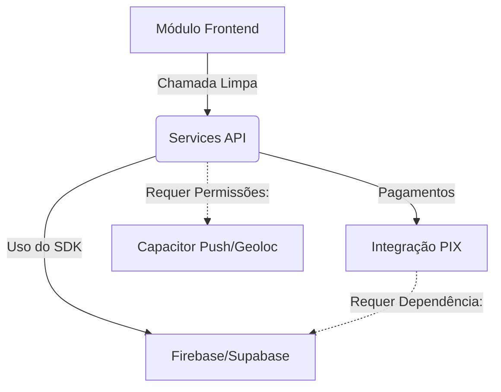

# SISTEMA INTELIGENTE DE INTERLIGAÇÕES - FÁBRICA DE APPS

## Objetivo
O objetivo deste documento é fornecer à IA um conjunto de regras estritas de interligação. Sempre que a IA for instanciada para adicionar uma nova funcionalidade, ela não deve simplesmente injetar código sem contexto. Ela DEVE ler o `mapa_dependencias.json` e seguir as diretrizes abaixo.

## A Regra do `/grill` (Validação Antecipada)
Sempre que o usuário solicitar algo complexo como `/grill PIX` ou criar uma "Integração X", a IA deve:
1. Consultar a dependência correspondente no JSON.
2. Formular o plano e fazer as perguntas necessárias (Grill me).
3. **Não prometer sem executar**: Se a IA disser "Vou fazer", ela deve começar a executar as tarefas imediatamente em formato de check-list. Ficar pedindo horas e não retornar nada está estritamente proibido.

## Isolamento Front vs Backend
- **Front-end:** Tudo que diz respeito à UI, layouts (`.css`, animações) é intocável ao trabalhar no backend.
- **Backend / Services:** Modificações de regras de negócio devem ocorrer preferencialmente dentro de `src/services/` e testadas via funções separadas sem interferir na renderização de componentes React a menos que as props exijam.

## Diagrama de Fluxo Interno
A troca de informações segue este infográfico mental que a IA deve respeitar:

Se o usuário pede para mexer em `D`, a IA **obrigatóriamente** checa se `C` está bem estruturado. E não toca em `A` (Visual) sem aprovação expressa.
