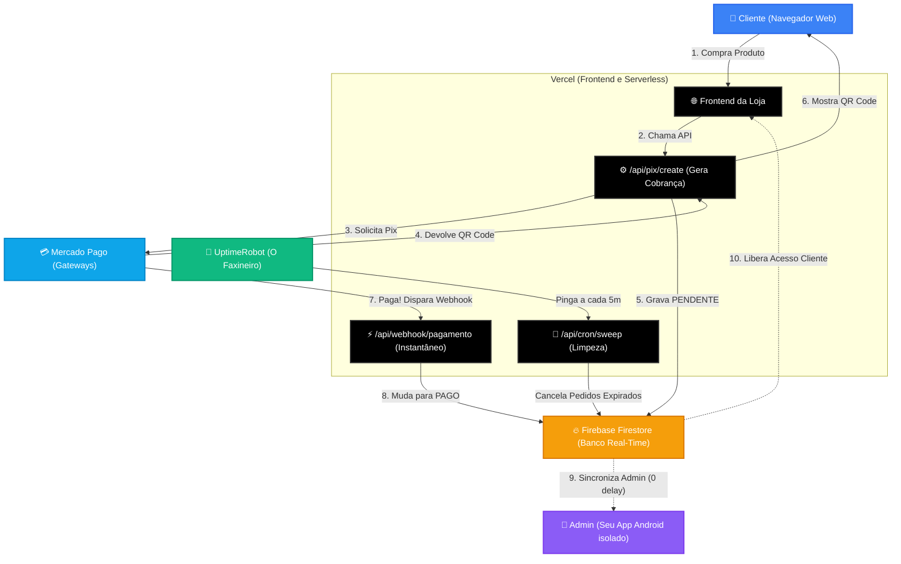

# 🗺️ Infográfico Arquitetural Universal

Qualquer projeto gerado a partir deste Kit seguirá o fluxo abaixo para garantir escabilidade gratuita, zero gargalos e comunicação em tempo real.

## Como a Arquitetura Previne Bugs:
1. **Desacoplamento Front vs Admin:** O cliente nunca toca no código do Admin, pois ele roda isolado no seu celular via Capacitor.
2. **Webhooks Serverless:** Se 50 pessoas pagarem ao mesmo tempo, a Vercel acorda 50 webhooks em paralelo que escrevem no Firebase sem formar fila de processamento.
3. **Mágica do Firestore:** O servidor Vercel "morre" rápido para não gerar custos. A responsabilidade de manter o aplicativo Web ou Android atualizado na tela é do websocket passivo do Firebase, que é extremamente leve.
